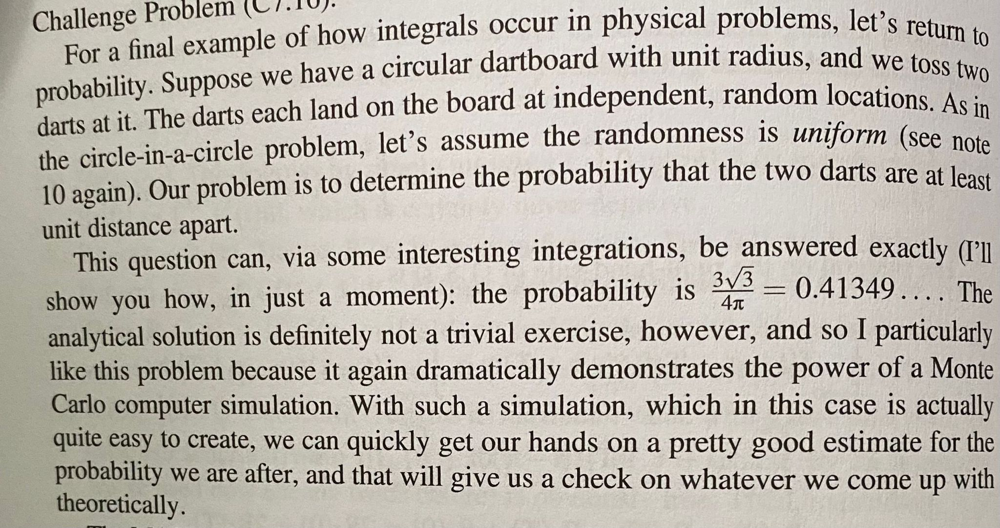

**Monte Carlo Simulation for Dartboard Problem**

[](https://opensource.org/licenses/MIT)

## Table of Contents
- [Introduction](#introduction)
- [The Dartboard Problem](#the-dartboard-problem)
- [Monte Carlo Simulation](#monte-carlo-simulation)
- [Implementation](#implementation)
- [How to Use](#how-to-use)
- [License](#license)

## Introduction
This repository contains a C program that demonstrates the use of Monte Carlo simulation to estimate the probability of two darts landing at least one unit distance apart on a circular dartboard with a unit radius. The Monte Carlo simulation is a powerful and widely used computational technique for solving complex mathematical problems, especially when traditional analytical methods are impractical or computationally expensive.

This was another exercise from my professor @Bernd-Ulmann. 


## The Dartboard Problem
The Dartboard Problem presents an intriguing question: what is the probability that two darts, randomly thrown at a circular dartboard with a unit radius, will land at least one unit distance apart from each other? This problem involves integrals and can be analytically solved, yielding an exact probability of (3√3)/4*π ≈ 0.41349.

## Monte Carlo Simulation
Monte Carlo simulation is a statistical method based on random sampling to obtain numerical results for various problems. It gets its name from the famous casino in Monaco and relies on generating random samples to approximate complex calculations. The fundamental idea is to perform a large number of random experiments (in this case, throwing darts) and use the results to estimate the desired quantity (the probability of the darts being one unit apart).

Monte Carlo simulations are particularly useful when dealing with multidimensional problems or when a closed-form solution is challenging to obtain. The precision of the result improves as the number of random samples (simulations) increases. Although the method provides an estimate rather than an exact solution, it is computationally efficient and can yield accurate results when a sufficient number of samples are used.

## Implementation
The C program in this repository uses the Monte Carlo simulation technique to estimate the probability of two darts landing at least one unit distance apart on a circular dartboard. The simulation throws a large number of darts (10 million by default) with random coordinates on the dartboard. It then calculates the distance between each pair of darts and counts the number of times the distance is at least one unit apart. The estimated probability is obtained by dividing the count by the total number of darts thrown.

## How to Use
To run the program and obtain an estimate of the probability, follow these steps:
1. Clone this repository to your local machine.
2. Open a terminal or command prompt and navigate to the repository's directory.
3. Compile the C program using a C compiler, for example:
    ```bash
    gcc -o dartboard_simulation dartboard_simulation.c
    ```
4. Run the executable:
    ```bash
    ./dartboard_simulation
    ```
5. The program will perform the Monte Carlo simulation and print the estimated probability on the console.

Feel free to modify the value of `NUM_DARTS` in the C code to increase or decrease the number of darts thrown, adjusting the precision of the estimate.

## License
This project is licensed under the MIT License - see the [LICENSE](LICENSE) file for details.

---

By using this Monte Carlo simulation, you can gain valuable insights into the Dartboard Problem without resorting to complex analytical solutions. The program's simplicity and efficiency demonstrate the power and versatility of Monte Carlo methods, making them valuable tools in various scientific and engineering fields. Whether you're exploring probabilities, statistical mechanics, financial modeling, or other complex systems, Monte Carlo simulation can be an indispensable addition to your computational toolkit.

Feel free to use and modify this code to suit your specific needs or integrate it into other projects. Happy simulating!
